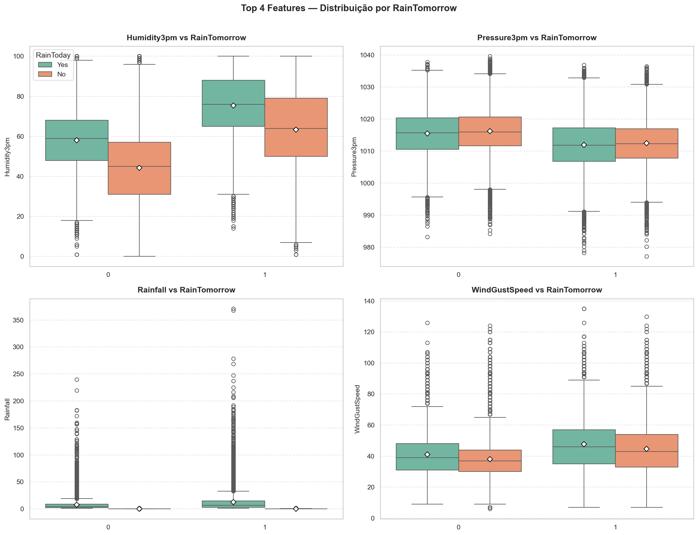
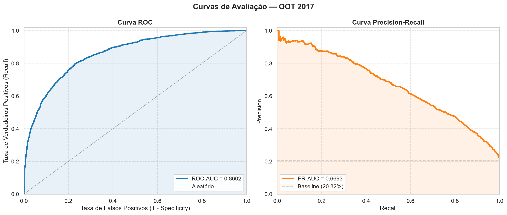
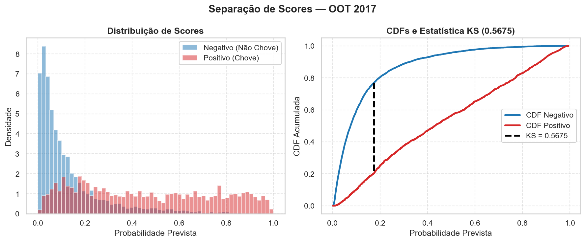
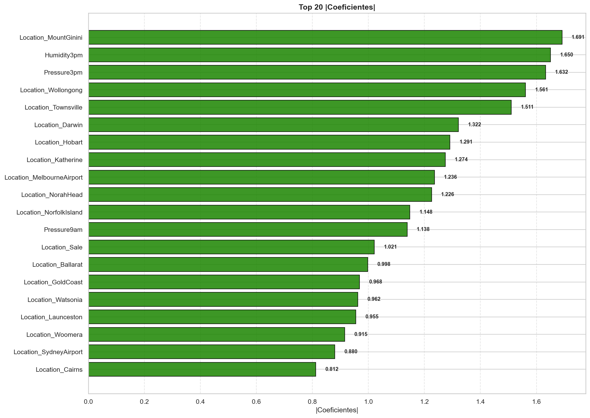
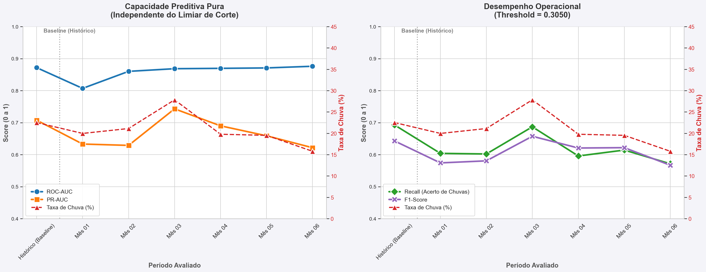

# 🌧️ Rain Prediction Model — Previsão de Chuva na Austrália


---

## Sobre o Projeto

Este repositório apresenta um projeto de **Machine Learning** para previsão de chuva no dia seguinte (`RainTomorrow`), utilizando o dataset **weatherAUS** com **~145.000 registros** de observações meteorológicas diárias em **49 cidades australianas** ao longo de quase 10 anos (2008–2017).

O objetivo é construir um modelo de **classificação binária** capaz de prever, com base nas condições meteorológicas de hoje, se choverá amanhã, com foco em:

- Pipeline robusta de pré-processamento com **4 estratégias de complexidade crescente**
- **Otimização de threshold** via curva Precision-Recall
- Validação temporal **Out-of-Time (OOT)** para avaliar estabilidade do modelo
- Análise de **Feature Drift (PSI/KS)** e **Target Drift** entre períodos
- Reprodutibilidade total via scripts (`train.py`, `predict.py`) e `src/pipeline.py`

### Como o Modelo Funciona

O modelo é uma **Regressão Logística com regularização L1 (Lasso)** que aprende, a partir de dados históricos, a probabilidade de chuva no dia seguinte. Na prática:

1. **Entrada:** as condições meteorológicas de um dia (umidade, pressão, temperatura, vento, chuva acumulada, localização, etc.)
2. **Pré-processamento:** o pipeline aplica automaticamente transformação logarítmica no `Rainfall`, imputa valores nulos com mediana, aplica One-Hot Encoding nas variáveis categóricas e escalona todas as features com `RobustScaler`
3. **Decisão:** o modelo combina as features ponderadas por seus coeficientes e gera uma **probabilidade entre 0 e 1**. Se essa probabilidade ultrapassa o threshold otimizado de **0.3175**, a previsão é "chuva amanhã"

As features mais importantes fazem sentido físico: **Humidity3pm** alta (+) e **Pressure3pm** baixa (−) são os sinais mais fortes de chuva. Além disso, a **localização geográfica** da cidade exerce forte influência — algumas cidades como MountGinini e Wollongong têm padrões climáticos muito distintos da média nacional.

<p align="center">
  
</p>

> As 4 features numéricas mais importantes mostram separação clara entre dias com e sem chuva: **Humidity3pm** mais alta e **Pressure3pm** mais baixa são os indicadores mais fortes de chuva no dia seguinte.

---

## Sobre o Dataset

O **weatherAUS** contém 23 colunas de dados meteorológicos:

| Tipo | Quantidade | Exemplos |
|------|-----------|----------|
| Numéricas | 14 | `Humidity3pm`, `Pressure3pm`, `Rainfall`, `MaxTemp` |
| Categóricas Nominais | 4 | `Location` (49 cidades), `WindGustDir` |
| Categóricas Ordinais | 2 | `Cloud9am`, `Cloud3pm` (escala 0–9) |
| Binárias | 2 | `RainToday`, `RainTomorrow` (target) |

> Consulte [`data/README.md`](data/README.md) para instruções de download e descrição completa das variáveis.

---

## Diferenciais do Projeto

### Quatro Estratégias de Pipeline

Foram desenvolvidas **4 pipelines** de pré-processamento com complexidade crescente, permitindo avaliar o trade-off entre dimensionalidade e performance:

| Pipeline | Features | Estratégia |
|----------|----------|------------|
| **Enxuta** | 6 | Apenas os melhores preditores, sem `Location` |
| **Intermediária** | 10 | Adiciona umidade e vento, sem `Location` |
| **Completa Otimizada** | 21 | Todas as features + `Location` (One-Hot), sem nulos massivos |
| **Completa c/ Nulos**  | 23 + OHE | Absoluto total, incluindo `Cloud`, `Sunshine`, `Evaporation` |

### Transformação Logarítmica do Rainfall

A variável `Rainfall` apresenta **assimetria extrema (skew ≈ 10)** e **curtose de 186**, com mediana zero. A transformação **`log1p`** suaviza a cauda longa antes do escalonamento:

```
Rainfall → log(1 + Rainfall) → RobustScaler
```

### Otimização de Threshold via Max F1

Em vez do threshold padrão de 0.50, o modelo utiliza um **threshold otimizado de 0.3175**, encontrado pela varredura da curva Precision-Recall maximizando o F1-Score. Isso recuperou **+16% de Recall**, mitigando a omissão (falsos negativos).

### Validação Temporal Out-of-Time (OOT)

Os dados foram separados por corte temporal:

| Conjunto | Período | Linhas | Taxa Target |
|----------|---------|--------|-------------|
| Histórico (treino + teste) | Nov/2007 – Dez/2016 | 133.727 (94%) | 22.52% |
| OOT (validação final) | Jan/2017 – Jun/2017 | 8.466 (6%) | 20.82% |

> Essa separação garante que o modelo seja avaliado contra dados **futuros** que nunca foram vistos durante o treinamento.

### Análise de Drift (PSI e KS)

O **Population Stability Index (PSI)** foi calculado para todas as features numéricas entre o histórico e o OOT:

- Todas as variáveis apresentaram **PSI < 0.10** → classificação **Estável (Sem Drift)**
- Maiores PSI: `Cloud3pm` (0.092), `Cloud9am` (0.083), `MaxTemp` (0.081) — reflexo da sazonalidade natural
- O modelo não sofre degradação por mudança de distribuição das features

### Impacto das Features Numéricas vs Categóricas

As 4 pipelines permitem comparar diretamente como cada tipo de variável impacta o modelo:

- **Features numéricas** (Humidity3pm, Pressure3pm, Rainfall, etc.) formam a base do modelo e já entregam boa capacidade preditiva sozinhas — a pipeline Enxuta (6 features) alcança ROC-AUC de 0.845
- **Features categóricas nominais** (Location, WindGustDir, WindDir9am, WindDir3pm) entram no modelo via **One-Hot Encoding**, expandindo a dimensionalidade de ~23 para **110+ features**. As 49 cidades sozinhas geram 49 variáveis binárias
- **Resultado:** a adição progressiva de features categóricas e nulos **aumentou consistentemente as métricas** — a pipeline Completa superou a Enxuta em +0.026 no ROC-AUC e +0.054 no KS. Porém, o custo computacional cresceu **desproporcionalmente**: o tuning via Optuna nos modelos completos demandou ordens de grandeza a mais de tempo de execução e memória

> O trade-off é claro: as features categóricas **melhoram a precisão**, mas o ganho marginal precisa ser ponderado contra o custo computacional — especialmente em cenários de produção com retreinamento frequente.

### Estrutura Profissional e Reprodutibilidade

O projeto foi estruturado para ser **100% executável fora de notebooks**, como um projeto de produção:

```bash
# Treina o modelo campeão e salva artefatos em artifacts/
python scripts/train.py

# Gera predições para qualquer CSV novo
python scripts/predict.py --input data/new_data.csv --output reports/predictions.csv
```

- **`src/pipeline.py`** encapsula todo o pré-processamento — as mesmas pipelines usadas nos notebooks são importadas pelos scripts, garantindo consistência absoluta entre análise e produção
- **`artifacts/`** contém o modelo serializado (`.joblib`), métricas (`metrics.json`) e metadados (`metadata.json`) — pronto para deploy
- **`scripts/train.py`** reproduz o treinamento completo do zero ao artefato final, sem dependência de notebooks
- **`scripts/predict.py`** recebe um CSV com dados brutos e devolve previsões com probabilidade calibrada

> Os notebooks (`01`, `02`, `03`) documentam o raciocínio analítico e as decisões, mas **nenhum resultado depende deles** — toda a solução pode ser reproduzida e executada via scripts.

---

## Modelagem

### Modelo Escolhido: Regressão Logística com Regularização L1

| Parâmetro | Valor |
|-----------|-------|
| Algoritmo | `LogisticRegression` |
| Penalidade | L1 (Lasso) |
| C (inverso da regularização) | 93.95 |
| Solver | `liblinear` |
| Threshold otimizado | 0.3175 |

A regularização **L1** atua como **seletor automático de features**, zerando coeficientes irrelevantes — ideal para o cenário com alta dimensionalidade (110 features após One-Hot Encoding de `Location` e direções de vento).

### Otimização Bayesiana com Optuna

Os hiperparâmetros foram otimizados via **Optuna** com 40 trials por modelo, maximizando o **PR-AUC** (métrica foco para bases desbalanceadas) com validação cruzada estratificada (K=5).

---

## Resultados Comparativos

### Baseline (Threshold = 0.50) — CV = 5

| Pipeline | Accuracy | Precision | Recall | F1 | ROC-AUC | PR-AUC | KS |
|----------|----------|-----------|--------|-----|---------|--------|-----|
| Enxuta | 0.8377 | 0.7164 | 0.4625 | 0.5621 | 0.8454 | 0.6623 | 0.5296 |
| Intermediária | 0.8383 | 0.7148 | 0.4693 | 0.5666 | 0.8508 | 0.6680 | 0.5386 |
| Completa Otimizada | 0.8460 | 0.7315 | 0.4994 | 0.5936 | 0.8633 | 0.6976 | 0.5612 |
| **Completa c/ Nulos** | **0.8485** | **0.7327** | **0.5152** | **0.6050** | **0.8719** | **0.7077** | **0.5765** |

> Modelos mais complexos superaram progressivamente os mais simples. O gap treino-validação é **praticamente zero** em todos os casos — sem overfitting.

### Com Threshold Otimizado (~0.32) — CV = 5

| Pipeline | Accuracy | Precision | Recall | F1 | ROC-AUC | PR-AUC | KS |
|----------|----------|-----------|--------|-----|---------|--------|-----|
| Enxuta | 0.8179 | 0.5878 | 0.6403 | 0.6129 | 0.8454 | 0.6622 | 0.5310 |
| Intermediária | 0.8176 | 0.5847 | 0.6556 | 0.6181 | 0.8506 | 0.6677 | 0.5393 |
| Completa Otimizada | 0.8245 | 0.5949 | 0.6922 | 0.6399 | 0.8689 | 0.7034 | 0.5721 |
| **Completa c/ Nulos** | **0.8303** | **0.6114** | **0.6755** | **0.6419** | **0.8710** | **0.7062** | **0.5763** |

> A calibração do threshold recuperou **+16% de Recall** no modelo campeão, reduzindo severamente a omissão.

### Validação Out-of-Time (OOT 2017)

| Métrica | Histórico | OOT 2017 | Gap |
|---------|-----------|----------|-----|
| Accuracy | 0.8297 | 0.8369 | +0.0071 |
| Precision | 0.6092 | 0.6083 | −0.0009 |
| Recall | 0.6803 | 0.6086 | −0.0717 |
| F1-Score | 0.6428 | 0.6084 | −0.0344 |
| **ROC-AUC** | **0.8718** | **0.8602** | **−0.0116** |
| PR-AUC | 0.7077 | 0.6693 | −0.0384 |
| **KS** | **0.5761** | **0.5675** | **−0.0087** |

> ROC-AUC e KS apresentam **gap mínimo** (−0.0116 e −0.0087), indicando excelente generalização temporal. A queda no Recall (−0.0717) está diretamente ligada à menor taxa de chuvas no OOT (20.82% vs 22.52%).

<p align="center">
  
</p>

<p align="center">
  
</p>

> O modelo separa claramente os dias com e sem chuva: a classe positiva (chuva) concentra-se em scores mais altos. O **KS de 0.5675** confirma excelente capacidade de discriminação mesmo em dados futuros.

---

## Features Mais Importantes (Coeficientes)

As 20 features com maior impacto no modelo campeão (|coeficiente| da LogisticRegression):

<p align="center">
  
</p>

| # | Feature | \|Coef\| | Direção |
|---|---------|---------|---------|
| 1 | `Location_MountGinini` | 1.691 | − |
| 2 | `Humidity3pm` | 1.650 | + |
| 3 | `Pressure3pm` | 1.632 | − |
| 4 | `Location_Wollongong` | 1.561 | − |
| 5 | `Location_Townsville` | 1.511 | − |
| 6 | `Location_Darwin` | 1.322 | − |
| 7 | `Location_Hobart` | 1.291 | − |
| 8 | `Location_Katherine` | 1.274 | − |
| 9 | `Location_MelbourneAirport` | 1.236 | − |
| 10 | `Location_NorahHead` | 1.226 | − |

> **Humidity3pm** (+) e **Pressure3pm** (−) são as features físicas mais impactantes: alta umidade à tarde aumenta a probabilidade de chuva, enquanto alta pressão diminui. As `Location_*` representam o efeito geográfico de cada cidade.

---

## Estabilidade Temporal (Mês a Mês no OOT)

<p align="center">
  
</p>

| Mês | ROC-AUC | KS | PR-AUC | Taxa Chuva |
|-----|---------|-----|--------|------------|
| Jan | 0.8070 | 0.4934 | 0.6331 | 19.97% |
| Fev | 0.8602 | 0.5843 | 0.6289 | 21.12% |
| Mar | 0.8685 | 0.5730 | **0.7431** | **27.84%** |
| Abr | 0.8696 | 0.5669 | 0.6900 | 19.78% |
| Mai | 0.8709 | 0.6033 | 0.6589 | 19.52% |
| Jun | **0.8761** | **0.6062** | 0.6217 | 15.79% |

> O **ROC-AUC se manteve estável** (0.86–0.88 do mês 02 em diante), mas o PR-AUC e Recall sofrem nos meses mais secos — efeito do **Target Drift** sazonal, não de degradação do modelo. O painel direito mostra que Recall e F1 acompanham a taxa de chuva: meses com mais eventos positivos geram métricas melhores.

---

## Veredito

O modelo **Completa c/ Nulos** com LogisticRegression L1 consolidou-se como a melhor solução:

- **ROC-AUC de 0.8718** no histórico e **0.8602** no OOT, ou seja, excelente generalização temporal
- **KS de 0.5761**, indicando capacidade de separação classificada como "Excelente" (>0.50)
- **Gap treino-validação ≈ 0**, sem overfitting
- **Pipeline robusto** que lida automaticamente com nulos, encoding e escalonamento
- **Threshold otimizado** (0.3175) que equilibra Precision e Recall

---

## Estrutura do Repositório

```
Rain_Prediction_Model/
├── data/
│   ├── weatherAUS.csv                  # Dataset original (~145k linhas × 23 colunas)
│   └── README.md                       # Instruções de obtenção dos dados
├── notebooks/
│   ├── 01_EDA_Tratamento.ipynb         # Análise exploratória e definição de pipelines
│   ├── 02_Modelagem.ipynb              # Baseline, tuning Optuna e feature importance
│   └── 03_Validacao_OOT_e_Drift.ipynb  # Validação temporal, PSI/KS e relatórios
├── src/
│   ├── pipeline.py                     # Pipelines de pré-processamento e loaders
│   └── drift.py                        # Análise de drift mensal e feature importance
├── scripts/
│   ├── train.py                        # Treina modelo campeão e salva artefatos
│   └── predict.py                      # Gera predições para CSVs novos
├── artifacts/
│   ├── modelo.joblib                   # Pipeline treinado (joblib)
│   ├── metrics.json                    # Métricas do modelo (test + OOT)
│   └── metadata.json                   # Hiperparâmetros e metadata do treino
├── reports/
│   ├── temporal_performance.csv        # Métricas mês a mês no OOT
│   ├── drift_report.csv                # PSI/KS por feature
│   ├── drift_reports.csv               # Métricas + PSI médio por mês
│   └── figures/                        # Figuras dos relatórios
├── utils.py                            # Funções auxiliares (plotagens, métricas, etc.)
├── requirements.txt                    # Dependências do projeto
├── .gitignore
└── README.md                           # Este arquivo
```

---

## Como Executar Localmente

### (1) Clone este repositório:

```bash
git clone https://github.com/caua-barreto/Rain_Prediction_Model.git
cd Rain_Prediction_Model
```

### (2) Crie um ambiente virtual:

```bash
python -m venv .venv
source .venv/bin/activate  # Linux/macOS
# .venv\Scripts\activate   # Windows
```

### (3) Instale as dependências:

```bash
pip install -r requirements.txt
```

### (4) Baixe o dataset:

Consulte [`data/README.md`](data/README.md) para instruções de download do `weatherAUS.csv`.

### (5) Execute os notebooks na ordem:

1. `notebooks/01_EDA_Tratamento.ipynb` — Análise Exploratória e definição de pipelines
2. `notebooks/02_Modelagem.ipynb` — Baseline, tuning e feature importance
3. `notebooks/03_Validacao_OOT_e_Drift.ipynb` — Validação temporal e relatórios

### (6) Ou use os scripts diretamente:

```bash
# Treina o modelo campeão e salva em artifacts/
python scripts/train.py

# Gera predições para um CSV novo
python scripts/predict.py --input data/new_data.csv --output reports/predictions.csv
```

---

## Limitações e Próximos Passos

### Limitações

- **Apenas LogisticRegression:** O projeto avalia exclusivamente o modelo linear. Modelos baseados em árvore (XGBoost, LightGBM, CatBoost) não foram comparados, embora possam oferecer performance superior.
- **Target Drift Sazonal:** A taxa de `RainTomorrow` varia entre 15.8% e 27.8% ao longo dos meses do OOT. O PR-AUC e o Recall são sensíveis a essa flutuação, gerando métricas instáveis em meses de estiagem.
- **Threshold fixo:** O modelo utiliza um threshold estático (0.3175). Em cenários com variação sazonal significativa, um `threshold dinâmico` (ajustado por mês ou estação) poderia mitigar a degradação do Recall.
- **Features com muitos nulos:** `Sunshine` (48% de nulos), `Evaporation` (43%) e `Cloud3pm` (41%) possuem falhas massivas de coleta. O pipeline imputa com mediana, mas a qualidade da informação nessas features é limitada.
- **Feature engineering temporal simples:** A coluna `Month` é usada apenas como auxiliar de análise (sazonalidade), não como feature do modelo. Features temporais mais ricas (dia do ano, estação, média móvel de chuva) poderiam capturar padrões sazonais diretamente.
- **Desempenho desigual por cenário de chuva:** O modelo tende a **errar mais em situações de pouca chuva** (estiagem) e acertar mais em cenários com chuva abundante. Nos meses mais secos do OOT (junho, com taxa de chuva de 15.8%), o PR-AUC caiu para 0.6217 — contra 0.7431 em março (taxa de 27.8%). Isso acontece porque, com menos eventos positivos, há menos "sinais" claros para o modelo distinguir dias secos de dias que terão chuva isolada, os padrões meteorológicos ficam menos evidentes quando a maioria dos dias é seca.

### Próximos Passos

1. **Avaliar modelos de árvore** para comparação com a LogisticRegression
2. Investigar **threshold dinâmico** por mês ou por estação do ano
3. Incorporar `features temporais` (dia do ano, média móvel de precipitação) ao pipeline
4. Testar **técnicas avançadas de imputação para as features com muitos nulos**

---

## Tecnologias Utilizadas

| Biblioteca | Uso |
|------------|-----|
| **Python 3.12** | Linguagem base |
| **Pandas / NumPy** | Manipulação e transformação de dados |
| **Scikit-learn** | LogisticRegression, Pipeline, ColumnTransformer, métricas |
| **Optuna** | Otimização bayesiana de hiperparâmetros |
| **SciPy** | Teste KS de duas amostras (`ks_2samp`) |
| **Matplotlib / Seaborn** | Visualização de dados |
| **Joblib** | Serialização do pipeline treinado |

---

*Desenvolvido por [Cauã Barreto](https://github.com/caua-barreto)*
*Junior Data Scientist*
